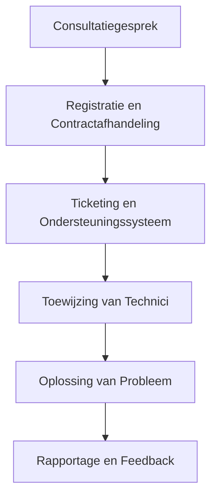

# Onboardingsproces

1. **Introductiegesprek:**  
   Het proces begint met een introductiegesprek tussen de klant en onze accountmanager. Tijdens dit gesprek worden de specifieke IT-problemen en incidenten besproken die de klant ervaart, evenals de verwachtingen van de klant met betrekking tot de dienstverlening.

2. **Probleemanalyse:**  
   Na het introductiegesprek voert ons team een grondige analyse uit van de IT-problemen en incidenten die door de klant zijn gemeld. Dit omvat het identificeren van de oorzaak van de problemen, het bepalen van de benodigde oplossingen en het inschatten van de tijd en middelen die nodig zijn voor probleemoplossing.

3. **Serviceovereenkomst:**  
   Op basis van de probleemanalyse wordt een serviceovereenkomst opgesteld waarin de diensten die worden geleverd, de tarieven en de voorwaarden worden vastgelegd. Dit omvat details over het uurtarief, de facturering en de reactietijd voor het oplossen van problemen.

4. **Implementatie van oplossingen:**  
   Nadat de serviceovereenkomst is goedgekeurd, begint ons team met het implementeren van de benodigde oplossingen om de gemelde IT-problemen op te lossen. Dit omvat het uitvoeren van reparaties, updates, configuratiewijzigingen of andere acties die nodig zijn om de problemen op te lossen.

5. **Monitoring en follow-up:**  
   Na het implementeren van de oplossingen wordt de IT-omgeving van de klant nauwlettend gemonitord om ervoor te zorgen dat de problemen volledig zijn opgelost en dat er geen nieuwe problemen ontstaan. Ons team staat klaar om snel te reageren op eventuele verdere problemen of vragen van de klant.

