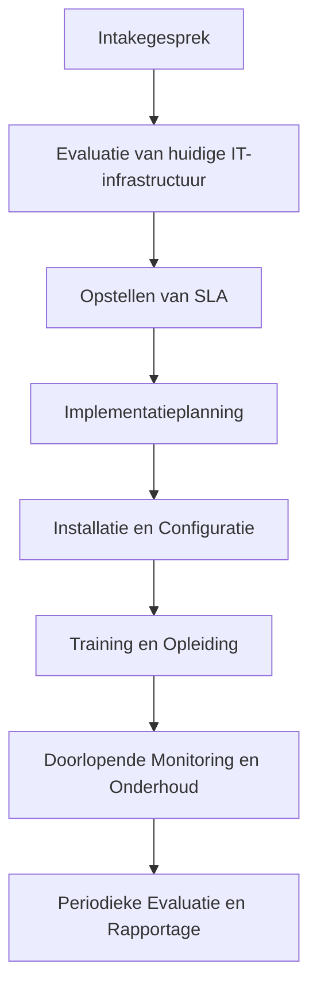

# Onboardingsproces

1. **Behoeftenanalyse:**  
   Het proces begint met een grondige behoeftenanalyse van de IT-infrastructuur van de klant. Dit omvat het inventariseren van de huidige IT-systemen, het identificeren van potentiële problemen of knelpunten, en het bepalen van de gewenste doelen en doelstellingen voor de IT-ondersteuning.

2. **Serviceplan opstellen:**  
   Op basis van de behoeftenanalyse wordt een maatwerk serviceplan opgesteld dat aansluit bij de specifieke behoeften en doelstellingen van de klant. Dit omvat details over de diensten die worden geleverd, de frequentie van de dienstverlening en de verwachte resultaten.

3. **Implementatie van diensten:**  
   Na goedkeuring van het serviceplan begint de implementatiefase, waarbij ons team de benodigde IT-systemen, software en apparatuur installeert en configureert. Dit omvat ook het uitvoeren van eventuele migraties, upgrades of updates die nodig zijn om de IT-infrastructuur van de klant te optimaliseren.

4. **Training en educatie:**  
   Als onderdeel van het onboarding proces bieden we ook training en educatie aan de klant en zijn medewerkers. Dit omvat het verstrekken van instructies over het gebruik van nieuwe systemen, software of tools, evenals het bieden van tips en best practices voor het optimaliseren van de IT-productiviteit.

5. **Doorlopende ondersteuning:**  
   Zodra het onboarding proces is voltooid, bieden we doorlopende ondersteuning aan de klant om ervoor te zorgen dat hun IT-systemen optimaal blijven presteren. Dit omvat proactieve monitoring, regelmatig onderhoud en snelle respons op eventuele problemen of vragen die zich kunnen voordoen.

Door deze specifieke stappen te volgen, kunnen we een gestroomlijnd en effectief onboarding proces bieden voor zowel Break en Fix Dienstverlening als Maandelijkse IT Dienstverlening.

