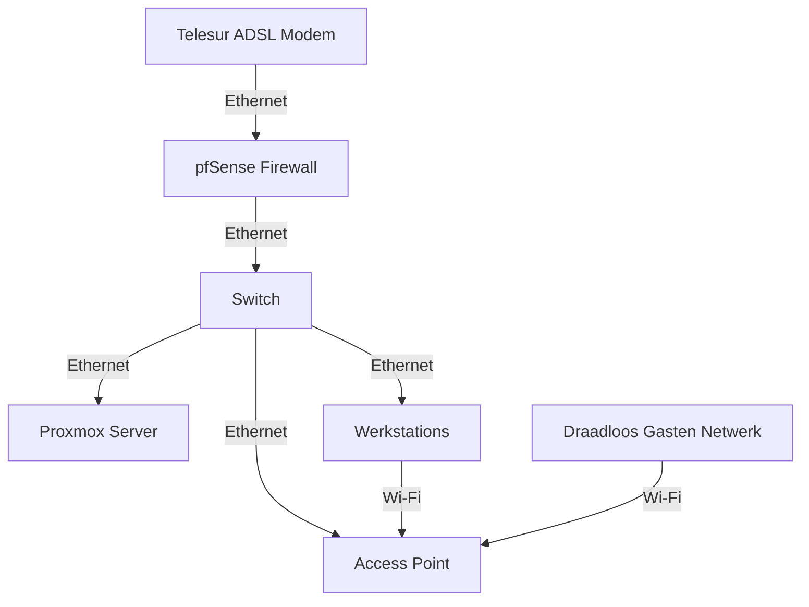

# Netwerkarchitectuur voor een Middelgroot Bedrijf

1. **Internet Service Provider (ISP):** Het bedrijf ontvangt internetconnectiviteit via een ADSL-modem van Telesur, dat fungeert als de toegangspoort tot het internet.

2. **Firewall (pfSense):** De pfSense firewall wordt gebruikt om het netwerk te beschermen tegen ongeautoriseerde toegang vanaf externe bronnen en om het interne netwerkverkeer te beheren. Het fungeert als de primaire gateway voor het interne netwerk.

3. **Switch:** Een switch wordt gebruikt om meerdere netwerkapparaten met elkaar te verbinden en het netwerkverkeer tussen deze apparaten te routeren. Het fungeert als een lokale verbindingshub voor de Proxmox-server, werkstations, accesspoints en andere netwerkapparaten.

4. **Proxmox Server met Windows Server 2019:** De Proxmox-server draait virtualisatiesoftware en host meerdere virtuele machines, waaronder een Windows Server 2019 die fungeert als een lokale domeincontroller. Deze server biedt authenticatie, autorisatie en andere netwerkdiensten voor het interne netwerk.

5. **Access Point voor Draadloos Netwerk:** Een draadloos accesspoint wordt gebruikt om draadloze connectiviteit te bieden aan de medewerkers van het bedrijf. Het accesspoint zendt een draadloos signaal uit voor verbinding met draadloze apparaten zoals laptops, smartphones en tablets. Het draadloze netwerk opereert bijvoorbeeld op het subnet 192.168.1.0/24.

6. **Werkstations:** Er zijn 7 tot 10 werkstations aanwezig die worden gebruikt door de medewerkers van het bedrijf. Deze werkstations zijn verbonden met het interne netwerk en hebben toegang tot gedeelde bronnen, internet en andere netwerkapparaten.

7. **Draadloos Gastennetwerk:** Een apart gastennetwerk wordt geïmplementeerd bijvoorbeeld op het subnet 10.0.1.0/24 voor klanten en bezoekers van het bedrijf. Dit netwerk is gescheiden van het interne netwerk van het bedrijf en biedt alleen internettoegang zonder toegang tot interne bronnen of gevoelige informatie.

Hier is een vereenvoudigd diagram van het netwerkarchitectuur:

Dit diagram toont de verbindingen tussen de verschillende netwerkcomponenten en de stroom van gegevens door het netwerk. De firewall fungeert als een centraal punt voor de netwerkbeveiliging, terwijl de switch zorgt voor connectiviteit tussen alle apparaten in het netwerk. De Proxmox-server draait virtuele machines, waaronder een Windows Server 2019 voor lokale domeindiensten.